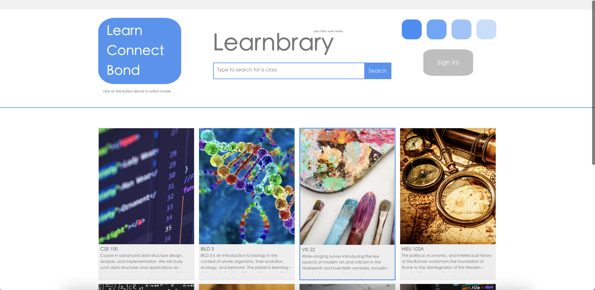
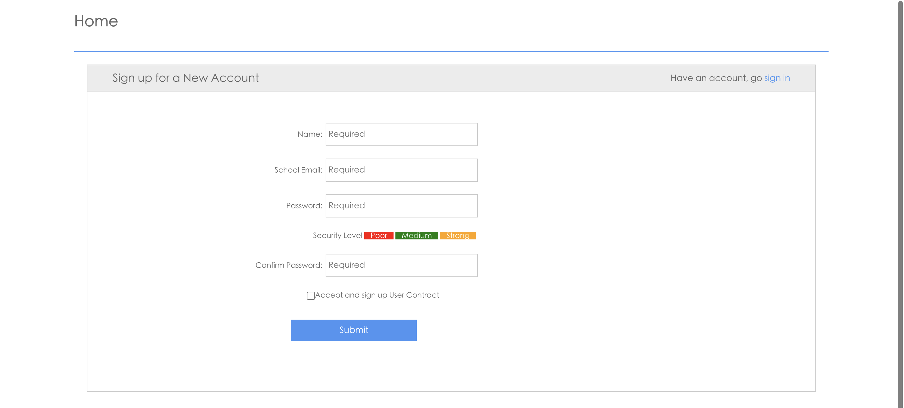
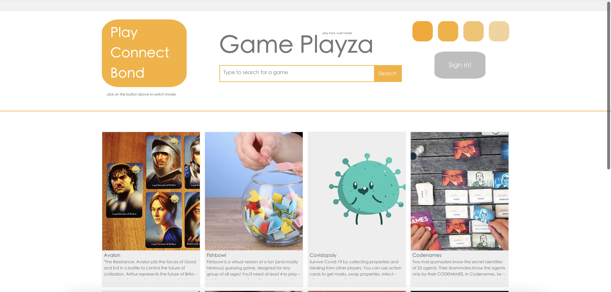

# Learning Plaza Documentation
`Learning Plaza` is an online web for university students to study and communicate with each other more effectively under today's covid situation.
We aims to make an effictive web to make today's socialize effectively.

The following shows the hierarchy of the website:
- [Learning Plaza Documentation](#learning-plaza-documentation)
  - [Learning Plaza](#learning-plaza)
      - [Sign in Page](#sign-in-page)
      - [Create/Join Room](#createjoin-room)
  - [Game Plaza](#game-plaza)

## Learning Plaza
The Learning Plaza section allows students to sign in with their school edu account, and create/join their course room (e.g. Math 221, Comp Sci 300). Home Page contains: 1) login/sign in button 2)Cards with course number for students to choose 

#### Sign in Page
* User can sign up with their Name and personal School edu address 

#### Create/Join Room
* There are two choices in this section: 
    * Host a new room
    * Join an existing room
* The Queue board shows all info about the existing rooms.

   
                                                             

## Game Plaza
The Game Plaza section allows students to sign in with their school edu account, and create/join the game room. Home Page contains: 1) login/sign in button 2)Cards with game name for students to choose 

